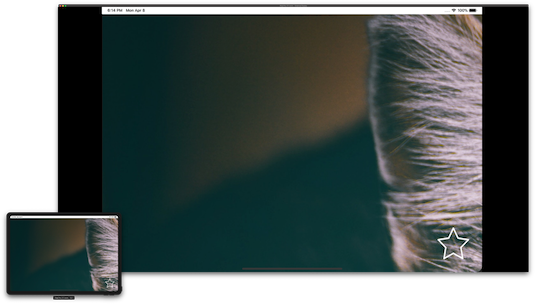
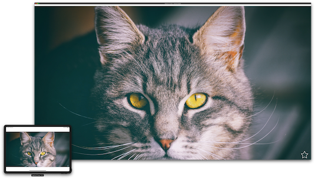

# HiResMirroring

[](https://opensource.org/licenses/MIT)

The HiResMirroring is a framework that enables High-resolution mirroring of the iPad App screen to external display


#### Default Mirroring

The iPad will start mirroring the screen automatically when connected to an external display. 



The contents of the iPad screen will be mirrored and displayed on the external display.

Content larger than the iPad screen size can not displayed on the external display.

#### Hi-Resolution Mirroring

This framework allows the app to mirroring the content in the resolution of the external display.



The contents of the external display will be mirrored and displayed on the iPad screen.

Content is displayed on the external display even if it is larger than the iPad screen size.

- [Features](#Features)
- [Getting Started](#getting-started)
    - [Requirements](#requirements)
    - [Installation](#installation)
- [Usage](#usage)
	- [Operate the external display](#operate-the-external-display)
- [Author](#author)
- [License](#license)
- [Acknowledgments](#acknowledgments)

## Features
- [x] Mirroring the main window on the external display in High-resolution.
- [x] Operate the external display from the screen of the iPad.

## Getting Started

### Requirements

* iOS 12.0+
* Xcode 10.0+
* Swift 4.2+
* iPad Pro 2018+

### Installation

**[Cocoa Pods](https://cocoapods.org)**

```sh
pod "HiResMirroring", :git => 'https://github.com/watanabetoshinori/HiResMirroring.git', :branch => 'master'
```

## Usage

Add the following code to AppDelegate.

```swift
// Importing the package.
import HiResMirroring


func application(_ application: UIApplication, didFinishLaunchingWithOptions launchOptions: [UIApplication.LaunchOptionsKey: Any]?) -> Bool {

    // Enable Hi-Res mirroring.    
    window?.enableHighResolutionMirroring()
    
    return true
}
```

When the external display is connected to the device, the current window is displayed on the external display.


### Operate the external display

You can use the iPad screen to operate the external display.
When you tap the screen on the iPad, the tap event is also transmitted to the external display.

## Example App

Example App for HiResMirroring. See the [Example](Example) directory.

You need to add a 4K resolution wallpaper (wallpaper.jpg) to [Assets directory](Example/Source/Assets.xcassets/wallpaper.imageset/) before running the Example App.

## Author

Watanabe Toshinori – toshinori_watanabe@tiny.blue

## License

This project is licensed under the MIT License. See the [LICENSE](LICENSE) file for details.

This project uses some [KIF](https://github.com/kif-framework/KIF) source code. They are under the [KIF's License](Source/FakeTouch/KIF/LICENSE).

## Acknowledgments

This project refers to the code of the following projects:

* [KIF](https://github.com/kif-framework/KIF)
* [PTFakeTouch](https://github.com/Retr0-star/PTFakeTouch)
* [ZSFakeTouch](https://github.com/Roshanzs/ZSFakeTouch)
